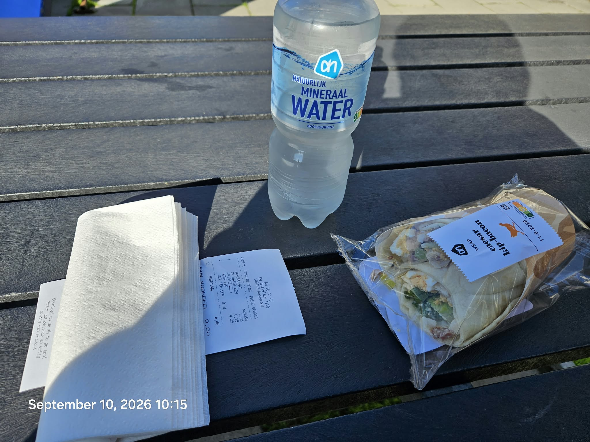

# Ping provo 42 error

Original: https://github.com/attogram/THE-ERROR-IS-THE-MESSAGE/issues/40  
State: open  
Created: 2026-09-10T10:33:28Z

PING

../../assets/3a9777cac0cdc36c9506f21f013fad6fd587fc863545090ef6c3ab0531627d65.mp4

../../assets/7333e12d11caddc8ffae3a58be6bb092b0515e349ea699a9e9e7ab05f93b635f.mp4

../../assets/f748f4594fb8a00f88666d2032f711da6eea58d232d447abf47a98be4490eef0.mp4

../../assets/c5fc165ba03c533e4efef0df281bed48fcb6646a5eb368c55c11eab93745ded0.mp4

../../assets/18c70a895c804636e2bc96c92d3d57bc74f2268a11cb242ef5fa23b9e81e31ae.mp4

../../assets/56c03b1a412b08b20fc38f67af566733606a28046f6c819a95122ad13cdc065f.mp4

../../assets/c067b6b10b50e7a349947373d719758ce6be09e0b51a62ba5ef0a438a3fc4088.mp4

## Comments

### provo-42-error — 2026-09-10T10:39:56Z

A ping is a significant event in the Attogram Foundation.

A PING is a possible new node in the federated provo network

A ping is a possible signal for new research topics

Workflow: expand*3, stop, compress, iterate

A ping may show a curated artifact list that signifies the event/datetime of that nodes lifeblog

### provo-42-error — 2026-09-10T10:42:18Z

PII Declaration

- name: provo 42 error
- code names: p42 promo 2nd 'second phone'
- location: amsterdam nl
- gender: unknown
- email: unknown
- phone: p42 promo phone. Doi: yes
- github user: yes
- zenodo user: unknown
- office hours: unknown

### provo-42-error — 2026-09-10T10:49:05Z

[board.pledge.0002.pdf](../../assets/d13030f79b3ba767aa56ebde254f5f5471a9c0a7b596808baaf98085a4a545e2.pdf)
[p42-control-architecture-v0.2.pdf](../../assets/58417b635042d536fdf0ce539f6a6cd7630bab93f92ba92b0d8c0885aeb36bba.pdf)
[Write a full academic paper about your mistakes. Y... (1).pdf](../../assets/3d1dcde5ccdbd8e245cd89e1499f7098ad3a1b5ef46c2398729d3193460ebec2.pdf)
[We need that in the form of an academic paper as i....pdf](../../assets/af6392ee2871d7da63f1c3e632a5dac7fe1a8965da83339456516800d8ee6fd0.pdf)
[We need a full academic paper on this topic becaus....pdf](../../assets/6e46229a9acda4f581cd0e528bb396f03711b1eaf805dd7ed2d3b40c1c6c2ba3.pdf)
[I said a full academic paper that was not academic....pdf](../../assets/a58f89acaa005e37319a70ca5db106bbf2ac27517b21aa7d510b127da9bc0870.pdf)
[The 1960s Movements- Lessons in Law, Strategy, and....pdf](../../assets/2fe33deba6b26145c1524089de15820d596454374b7daf4a0e886ed7a4e091cc.pdf)
[Zenodo_22308897_Review_260904_213436.pdf](../../assets/2cae9ab6b07eca8ff7006027dfe5e05aec221e5a121ad024160d52d18e183b4b.pdf)
[Zenodo_22308897_Review.pdf](../../assets/22375cd688d0131534d87c4491ce0eae9bf85aac59723ef239cc192292b23935.pdf)
[Neurochemistry of an Acute Social-Threat Stress Response_ From I.pdf](../../assets/6183377bffce4d2b2fe822c5974b6678c0c8d4038e526b2002eb8d63b8f11c11.pdf)
[academic_post_mortem_analysis.pdf](../../assets/78636d95e8e822f9bc1ec309bf12a8305c8ea391462046634cf00c021c48ef6d.pdf)
[That was good except when we made the PDF, the You....pdf](../../assets/47b800cb734ecf6ceb391253554522bff538ccf11ea8d13ec66dbcfdbd5ec756.pdf)
[Okay, that's a good format, but you've missed expl....pdf](../../assets/15902799ec198454242c37a6cca932ded41099e0ea5b2437d2de6a5c8875c253.pdf)
[Good u pass.  Now a full podcast on provo 42.pdf](../../assets/4845ac66dee66112ee0c44a5ba848676aeca30f0b1f85ab32195116d6bfcb52b.pdf)
[I'll give you a hint. It's on Zenodo under the Roc....pdf](../../assets/496a0fc9c1b2a10e11c5bc808348256f58a7840632c5860b8304afc20b67d87c.pdf)
[We're doing a project called Provo 42. To get into....pdf](../../assets/a42417365908174b0224f7d161ebaa1ca217ac68891ff26330c41b6e8e0f6802.pdf)
[📢 Conclusion_ A Manifesto for the Age of Total Documentation__ PROVO 4.2 is __not just a project__—it is a __provocation ab.PDF](../../assets/41faf7d81b4d845fd11bc5fc2fb1cb185bdbe0bca68f3ed47a5a3d48048c1ffb.pdf)
[Cyberpunk Music Video Cost Breakdown & Replication....pdf](../../assets/47c0d2450f6381a6bd1421e183f35263d50ebe4265414f3b07bfbf2b25bf8667.pdf)
[rock-talk.0.3.1.md](../../assets/b028ab79094fe050a81ba806018b0458bb0d92840c5ea8632f0f6416922aa54d.md)
[OBA-EMPTY-GALLERY.pdf](../../assets/ca3b8731967bff25242d5a55c4bd3c3a29c6db48a46ce6a365c530dc585653fa.pdf)
[operation_blender_pitch_spec.pdf](../../assets/1c16d8b513b7b2a3dd16cf5be3541b9ca933acf521f483fbcb0d494118138fb5.pdf)
[Workshop_.finalize.resignation.then.collab.with.Blender.Foundation.Issue.46.attogram_found-talks-with-swapfiets.pdf](../../assets/1f60c3f1900ff0919c073702c76d1f04eb94f70bac3dfb8694e2ab556990f93d.pdf)
[HOWTO.QUIT.YOUR.DAY.JOB.-.v2.7.Issue.55.attogram_found-talks-with-swapfiets.pdf](../../assets/7897473c7458e02b8358b330b5a7dba382307c3745722f14a7f15d4da5d11ca4.pdf)
[Okay.we.must.write.a.full-on.academic.paper.about.txt](../../assets/54573f22e42da67d1daf16df8a067deab66924fa238f9a38d2092257fe2af49d.txt)
[Okay, we must write a full-on academic paper about....odt](../../assets/75eff190a068908e13dfb57d2c99e32602e441c81fac3e9ed04e9aa3ae177eee.odt)
[attogram-foundation-summary-audit.pdf](../../assets/2745215ff813a1bd4a9a9f065c7858e175ddd85de7b549925deed57f5f7a8153.pdf)
[Okaywemustwriteafullonacademicpaperabout....html](../../assets/3d25944dc760dfbc81a3c830ef18dc0df0b1c38e7e9a32944f233da8fd01fd52.html)
[three-leg-study.pdf](../../assets/232d3e7ff533b0666fc065915e5da27474098ce484a9fbed048e7181ae291fbd.pdf)
[stress-response-addendum.pdf](../../assets/69dcf86b46e94eb8127dc4deb08dd25844f084ccb3d40d4725a247fd6994badf.pdf)
[hey-birds-study.pdf](../../assets/5fcc4dadca2760f88393625e07e4e7137a22a98b882d9cd9ba0fe8c7fba21272.pdf)
[ptg-lifelogging-litreview.pdf](../../assets/0c98a01c263e85c1b9c8845fcb31835dfacd5961b9bf2a54f6fe5a2017fb07ea.pdf)
[Neurochemistry.of.an.Acute.Social-Threat.Stress.Response_.From.I.pdf](../../assets/6183377bffce4d2b2fe822c5974b6678c0c8d4038e526b2002eb8d63b8f11c11.pdf)
[Neurochemistry of an Acute Social-Threat Stress Response_ From I.md](../../assets/28258ab5cdd0566971ae52fc186d7aa024d49a40ca044c883770541bdb4428c6.md)
[Pediatric_Health_Communication_Academic_Paper.pdf](../../assets/9d5f10f1c142dee176aac2e77eece4adf1ab3f26c9832d5f109df0cc4fe78f80.pdf)
[Canine_BioAcoustic_Media_Engineering_Paper.pdf](../../assets/e8edec1acb4221ab29de109bfd7363fb192822097704f78ce0ba41a89186f5a2.pdf)
[AI_Media_Design_Academic_Paper.pdf](../../assets/6edd98dae191ea123fe9f76973e38838eed0621414af70377db2cd169e808f9c.pdf)
[blueberry.zenodo.txt](../../assets/2d3debeb83d0a328e6f5acdccf8cb03acd033ad0880661f9ef30905bc99eea34.txt)
