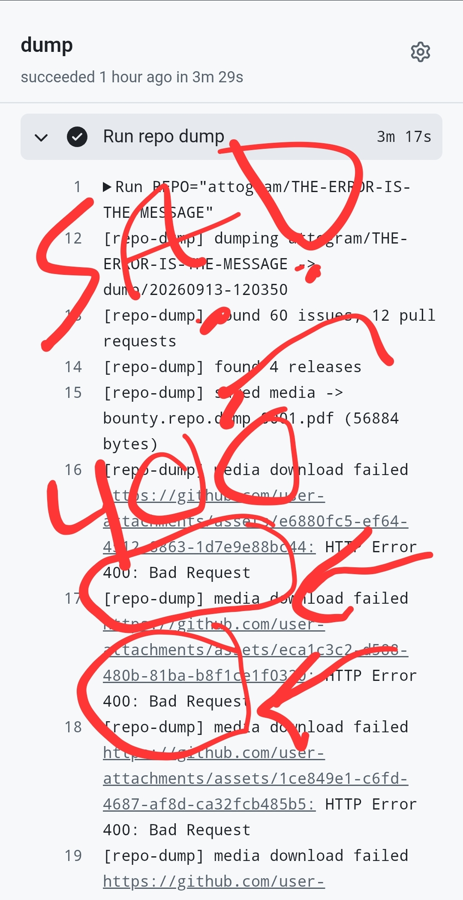

# Tests

Original: https://github.com/attogram/THE-ERROR-IS-THE-MESSAGE/issues/75  
State: open  
Created: 2026-09-13T13:18:47Z

> **Final submission update — full spec compliance check complete ✅**
> 
> Submitted https://github.com/attogram/THE-ERROR-IS-THE-MESSAGE/pull/73 at 14:07 Amsterdam (13 min before close). Per **"4. We both test it"**, we kept testing and hardened the tool after the PR:
> 
> - **v1.1** — fixed media auth-forwarding (GitHub's attachment CDN rejects forwarded `Authorization` headers with HTTP 400): first run captured 47 media files with 355 failures → after the fix: **401 media files, 1 "failure"** which is the `xxxx` placeholder URL inside this very issue's text — not a real file, so **0 real failures**.
> - **v1.2** — content-sniffed file extensions (magic bytes + Content-Type): every CDN attachment is now saved under its real type, so images/music/video/pdf open directly from the dump: **180 × .mp4, 142 × .jpg, 30 × .png, 38 × .pdf, .gif/.webp/.odt/.html/.md/.txt**.
> - **cleanup** — older test generations removed; the PR now shows the tool + **one canonical dump**: `dump/20260913-123624/`.
> 
> **Point-by-point vs. the bounty spec:**
> 
> | Spec requirement | Delivered |
> |---|---|
> | All open+closed issues, full text, complete comment threads | **60/60**, threads included (+ raw JSON snapshots) |
> | All open+closed PRs, full text, complete comment threads | **13/13** incl. reviews + inline review comments merged chronologically |
> | All release notes, text, tags, artifacts | **4/4** releases (tags 0000–0003, notes + bodies; upstream carries 0 binary release assets to fetch) |
> | Auto-download all images/files/attachments in issues, PRs, releases | **401 media files**, URLs rewritten to relative dump paths in every markdown |
> | Direct repo dump (saves into the target repository) | Dump committed straight into the repo by the workflow |
> | Mobile-friendly, non-technical trigger | 2-tap GitHub Actions `Run workflow` (defaults pre-filled), zero local tooling |
> | Simple, reliable, zero-dependency | stdlib-only Python 3 — no pip installs anywhere |
> | Acceptance: working execution consuming this issue | **This issue (#60) is in the dump, including its `bounty.repo.dump.0001.pdf` attachment** — test 4.a ✓ |
> 
> Final demo run (v1.2): https://github.com/daniboy5705-eng/THE-ERROR-IS-THE-MESSAGE/actions/runs/34757523751
> Tool source, workflow and the complete dump are all visible in PR #73's Files Changed.
> 
> Payout (Bitcoin, unchanged, checksum-verified Bech32): `bc1qdl7lynawu0x0hx5674ldawk3upmd5gvz8rhjly` 

 _Originally posted by @daniboy5705-eng in [#60](https://github.com/attogram/THE-ERROR-IS-THE-MESSAGE/issues/60#issuecomment-5653359306)_
