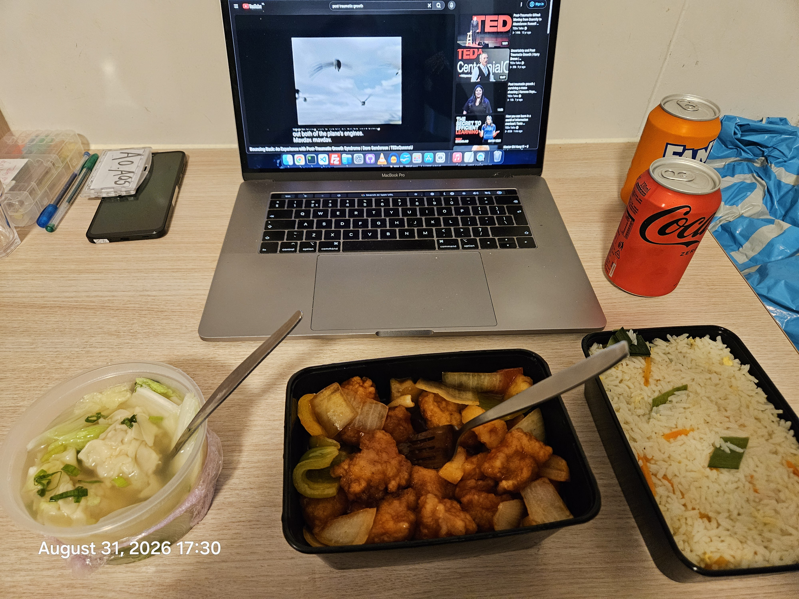

# 0001

Tag: `0001`

**Full Changelog**: https://github.com/attogram/THE-ERROR-IS-THE-MESSAGE/compare/0000...0001

[Open saved attachment](../../assets/e78a9fd24c02b8eee4d72376d6ef01f2e03c415daf1d2ddd5f639267ea7864e0.mp4)

[Open saved attachment](../../assets/559a3c389bbb9dc558fe23dcb0bbefecbfb1b5405cac6f5464b447059e463fcc.mp4)

[Open saved attachment](../../assets/9c405265d7e364fa9d373177578eb78a530ebe97e7896fc8e31a0844244ff6e6.mp4)

[Open saved attachment](../../assets/8056b9829b382cb8267239122394a351c63f2bcafb2be2d9b70246b75891aa6e.mp4)

[Open saved attachment](../../assets/a35ab87475d895a875620ed7ad1a7337d254725044c37eae7439d8a4a78580c6.mp4)

[Open saved attachment](../../assets/8b397e9bc525d710c9983190b11f4b0e337b550de083e45a5e49d162b0c8cca2.mp4)

[Open saved attachment](../../assets/d3526d9c5eafc46cd4f8d5206037948c5a3a4aa23cca249a61109a2cf75581ed.mp4)

[Provo 42 Field Operations Manual & Archival Ledger.pdf](../../assets/0f722ca362aeaf8c1dfade93253daa939345c0967b916de7ab00b4dffc8eec61.pdf)

[Open saved attachment](../../assets/b2a85cc38cf17bc60d1173c84c30dacdf1e975b7c22e4264ba7d55930e463246.mp4)

[Open saved attachment](../../assets/e6776f3c3d7990d797465bf5a1af4b45427ec4f570564e530f578fb9d86dfec1.mp4)

[Open saved attachment](../../assets/569c28d8655e9a8a17760119c5b95be86da78b3a906979a01b4720555a3c88e2.mp4)

[Open saved attachment](../../assets/d0a161867c18925fb1ff3ef676c5e1e70a611943a223c9c9737f7b97832d2e1c.mp4)

[Open saved attachment](../../assets/1a01b6da4cf64072c691085ff0c84029b3cca65d7d063b66e0f8e5b2067462f5.mp4)

[Open saved attachment](../../assets/a0792f99c20b5bfcc4d8ee5c03803e4045ba403b282a0891ed5fd941d7c8bd47.mp4)

[Open saved attachment](../../assets/8c4f4b97272c892c3bb79a14f31341cf48de9bc760a86c89deb7d846071e2e10.mp4)

[Open saved attachment](../../assets/7f222ff57ce99bf54be1cda1a2ba13ba580d3a5e2ed47e3d5ffb79ce4586a797.mp4)

[Open saved attachment](../../assets/309ea348b459216b8120aa63672bf6c4f3a64b05a18aefdfe42bc4966476da86.mp4)

[Open saved attachment](../../assets/a1f586a29931c098a41ae81a1d29b7211dc0f735effb7fd6a8b750c0fa724763.mp4)

[Open saved attachment](../../assets/1ae8143f2b7b4b45644667717dd3ed5a4b803b96c5493b2be2656640e98224ef.mp4)

[Open saved attachment](../../assets/b991586c82aadbedb164f5b588620e3756ae89ef89cdd456d244fb08cdfc3fcb.mp4)

[Open saved attachment](../../assets/ae6aac08cc81c2e65c95951bbd73beb3fa8be991ab08f027d5c5c24630bff19a.mp4)

[Open saved attachment](../../assets/7ac965db23f5a995b1ca23f370e0ad8e9cb050c0f402f94231e617a091330f25.mp4)

[Open saved attachment](../../assets/901e9dfaac92653e33f500530a36e8e822ce39569e2ac79ea09da168082eaa52.mp4)

[Open saved attachment](../../assets/4afc44860ae4012949a041550c5bcbe005259563fdad5fe637f7ed7a933a3a31.mp4)

[Open saved attachment](../../assets/5913d854369fc9f4126383e3de6498f8edee99a88d8e322b57e9b74dc7520d71.mp4)

[Open saved attachment](../../assets/f7cf53228e7d431dcee7d711ac43acfd0f1c12990c8c16b41fdc6522bc63c00c.mp4)

[Open saved attachment](../../assets/ed2302532cb5f9dcb161d893f2f44b2307bb421542658bb28fa0e575830cb5de.mp4)

[Open saved attachment](../../assets/d3339f9effb3d937ef3226b6293cf4ac0e4ce8fa0a9eac97c9da40b34edddc7c.mp4)

[Open saved attachment](../../assets/1dd7994577a9d01d72110ef7a3636c455852e7a9e1fbda99e993a5cb356a4a15.mp4)

[Open saved attachment](../../assets/8a7a5535f1b97c3184cadca4d6716dc1139ded799af2efbacb4c972110065a85.mp4)

[Open saved attachment](../../assets/ba0ee04b3ea2a74c73a969f592bf6db66960fbe559094682cd715427c5586187.mp4)

https://github.com/user-attachments/assets/f6d7b84c-e090-4149-8e45-0c265d6e6805

[Open saved attachment](../../assets/ff7303f57cdde05a2e9d9a460eaa27d1c44f1cf01b40a1b7bb7162235649e6e1.mp4)

Skip to content
THE-ERROR-IS-THE-MESSAGE
Repository navigation
Code
Issues
10
 (10)
All issues
Issues
Search Issues
is:issue state:open 
Search results

Select all issues: Search results
0 of 10 selected0 issues of 10 selected
Open
10
 (10)
Closed
0
 (0)
[DOI PENDING] Calculated Motion

Status: Open.
#10 In attogram/THE-ERROR-IS-THE-MESSAGE;· attogram opened 15m ago
Football....

Status: Open.
#9 In attogram/THE-ERROR-IS-THE-MESSAGE;· attogram opened 1h ago
6
comments
https://zenodo.org/records/22179960 - DIGITAL HISTORICAL ARCHAEOLOGY [DHA] Soundtrack batch 0003

Status: Open.
#8 In attogram/THE-ERROR-IS-THE-MESSAGE;· attogram opened 1d ago
https://zenodo.org/records/22171246 - DIGitaL HISTORICAL ARCHAEOLOGY [DHA] Videos batch 0002

Status: Open.
#7 In attogram/THE-ERROR-IS-THE-MESSAGE;· attogram opened 1d ago
attogram
Rain rain rain 2026 08 30

Status: Open.
#6 In attogram/THE-ERROR-IS-THE-MESSAGE;· attogram opened 1d ago
2
comments
# AI-Induced Psychosis: A Ward Observation *An essay on a phenomenon observed firsthand in a clinical psychiatric ward, August 2026.*

Status: Open.
#5 In attogram/THE-ERROR-IS-THE-MESSAGE;· attogram opened 1d ago
2
comments
Eat like a king

Status: Open.
#4 In attogram/THE-ERROR-IS-THE-MESSAGE;· attogram opened 1d ago
2
comments
Summary 2026.08.30 09:15

Status: Open.
#3 In attogram/THE-ERROR-IS-THE-MESSAGE;· attogram opened 1d ago
Mistral attempts DHA

Status: Open.
#2 In attogram/THE-ERROR-IS-THE-MESSAGE;· attogram opened 1d ago
5
comments
https://doi.org/10.5281/zenodo.22169941 - DIGITAL HISTORICAL ARCHAEOLOGY [DHA] Documents batch 0001

Status: Open.
#1 In attogram/THE-ERROR-IS-THE-MESSAGE;· attogram opened 1d ago
4
comments
attogram
Footer
© 2026 GitHub, Inc.
Footer navigation
Terms
Privacy
Security
Status
Community
Docs
Contact
Manage cookies
Do not share my personal information
 

## Release assets

- [0001.zip](../../assets/ed16135af105e14f705183769d7a98c4935657f129aec7bac18664e3b4916e49.zip)

- [0001.tar.gz](../../assets/b2b87910329b323ab92e2417bc583b98238ea5c0840cc3212e7433bb55f7a7e9.gz)
